# 尝尝咸淡RAG系统

## 项目目标

基于HowToCook项目的菜谱数据，构建一个智能的食谱问答系统。用户可以：

- 询问具体菜品的制作方法："宫保鸡丁怎么做？"
- 寻求菜品推荐："推荐几个简单的素菜"
- 获取食材信息："红烧肉需要什么食材？"

### 数据准备与分析

HowToCook项目包含了300多个MarkDown格式的菜谱文件。这些菜谱有两个关键特点：一是结构高度规整，每个文件都严格按照统一的格式来组织内容；二是内容篇幅较短，单个菜谱通常在700字左右。这使得数据预处理变得相对简单，不需要复杂的文本清洗和格式转换。

结构分块采取父子文本块的策略——小块检索，大块生成，用小块的精确性找到相关内容，用大块的完整性保证回答质量。

### 整体架构

```mermaid
flowchart TD
    %% 系统初始化
    START[🚀 系统启动] --> CONFIG[⚙️ 加载配置<br/>RAGConfig]
    CONFIG --> INIT[🔧 初始化模块]
    
    %% 索引加载/构建
    INIT --> INDEX_CHECK{📂 检查索引缓存}
    INDEX_CHECK -->|存在| LOAD_INDEX[⚡ 加载已保存索引<br/>秒级启动]
    INDEX_CHECK -->|不存在| BUILD_NEW[🔨 构建新索引]
    
    %% 构建新索引的顺序流程
    BUILD_NEW --> DataPrep
    DataPrep --> IndexBuild
    IndexBuild --> SAVE_INDEX[💾 保存索引到配置路径]
    
    %% 加载已有索引也需要数据准备（用于检索模块）
    LOAD_INDEX --> DataPrepForRetrieval[📚 加载文档和分块<br/>用于检索模块]
    DataPrepForRetrieval --> READY[✅ 系统就绪]
    SAVE_INDEX --> READY
    
    %% 用户交互开始
    READY --> A[👤 用户输入问题]
    A --> B{🎯 查询路由}
    
    %% 查询路由分支
    B -->|list| C[📋 推荐查询]
    B -->|detail| D[📖 详细查询] 
    B -->|general| E[ℹ️ 一般查询]
    
    %% 查询重写逻辑 - 合并相同处理
    C --> KEEP[📝 保持原查询]
    D --> KEEP
    E --> REWRITE[🔄 查询重写]
    
    %% 所有查询都进入统一的检索流程
    KEEP --> F[🔍 混合检索<br/>top_k=config.top_k]
    REWRITE --> F
    
    %% 检索阶段
    F --> G[📊 向量检索<br/>config.embedding_model]
    F --> H[🔤 BM25检索<br/>关键词匹配]
    
    %% RRF重排
    G --> I[⚡ RRF重排融合]
    H --> I
    I --> J[📖 检索到子块]
    
    %% 父子文档处理
    J --> K[🧠 智能去重<br/>按相关性排序]
    K --> L[📚 获取父文档]
    
    %% 生成阶段 - 根据路由类型选择不同模式
    L --> M{🎨 生成模式路由}
    M -->|list查询| N[📋 生成菜品列表<br/>简洁输出]
    M -->|detail查询| O[📝 分步指导模式<br/>config.llm_model<br/>详细步骤]
    M -->|general查询| P[💬 基础回答模式<br/>config.temperature<br/>一般信息]
    
    %% 输出结果
    N --> Q[✨ 返回结果]
    O --> Q
    P --> Q
    
    %% 数据准备子流程
    subgraph DataPrep [📚 数据准备模块]
        R[📁 加载Markdown文件<br/>config.data_path] --> S[🔧 元数据增强]
        S --> T[✂️ 按标题分块]
        T --> U[🏷️ 父子关系建立]
        U --> CHUNKS[📦 输出文本块chunks]
    end
    
    %% 索引构建子流程  
    subgraph IndexBuild [🔍 索引构建模块]
        CHUNKS --> V[🤖 BGE嵌入模型<br/>config.embedding_model]
        V --> W[📊 FAISS向量索引]
        W --> X[💾 索引持久化<br/>config.index_save_path]
    end
    
    %% 配置管理子流程
    subgraph ConfigMgmt [⚙️ 配置管理]
        CFG1[🎛️ 默认配置<br/>DEFAULT_CONFIG]
        CFG2[🔧 自定义配置<br/>RAGConfig]
        CFG3[🌐 环境变量<br/>HF_ENDPOINT]
    end
    
    %% 连接配置到各模块
    ConfigMgmt --> DataPrep
    ConfigMgmt --> IndexBuild
    ConfigMgmt --> F
    ConfigMgmt --> O
    ConfigMgmt --> P
    
    %% 样式定义
    classDef startup fill:#e3f2fd,stroke:#0277bd,stroke-width:2px
    classDef config fill:#f1f8e9,stroke:#388e3c,stroke-width:2px
    classDef userInput fill:#e1f5fe,stroke:#01579b,stroke-width:2px
    classDef routing fill:#f3e5f5,stroke:#4a148c,stroke-width:2px
    classDef rewrite fill:#e8eaf6,stroke:#3f51b5,stroke-width:2px
    classDef retrieval fill:#e8f5e8,stroke:#1b5e20,stroke-width:2px
    classDef generation fill:#fff3e0,stroke:#e65100,stroke-width:2px
    classDef output fill:#fce4ec,stroke:#880e4f,stroke-width:2px
    classDef module fill:#f1f8e9,stroke:#33691e,stroke-width:2px
    classDef cache fill:#fff8e1,stroke:#f57c00,stroke-width:2px
    classDef dataflow fill:#e1f5fe,stroke:#0277bd,stroke-width:2px
    
    %% 应用样式
    class START,INIT startup
    class CONFIG,ConfigMgmt,CFG1,CFG2,CFG3 config
    class INDEX_CHECK,LOAD_INDEX,SAVE_INDEX cache
    class A userInput
    class B,C,D,E,M routing
    class KEEP,REWRITE rewrite
    class F,G,H,I,J,K,L retrieval
    class N,O,P generation
    class Q output
    class DataPrep,IndexBuild module
    class BUILD_NEW,READY,DataPrepForRetrieval startup
    class CHUNKS dataflow
```



>PlantUML是「专业级建模工具」，适合技术团队深度使用；Mermaid是「效率优先的轻量工具」，适合全团队快速协作。在实际工作中，两者并非互斥——可以用Mermaid快速产出原型图，定稿后用PlantUML优化为专业架构图，形成「快速迭代+精准交付」的组合方案。


## 运行结果

```bash

```