# 尝尝咸淡RAG系统

## 项目目标

基于HowToCook项目的菜谱数据，构建一个智能的食谱问答系统。用户可以：

- 询问具体菜品的制作方法："宫保鸡丁怎么做？"
- 寻求菜品推荐："推荐几个简单的素菜"
- 获取食材信息："红烧肉需要什么食材？"

### 数据准备与分析

HowToCook项目包含了300多个MarkDown格式的菜谱文件。这些菜谱有两个关键特点：一是结构高度规整，每个文件都严格按照统一的格式来组织内容；二是内容篇幅较短，单个菜谱通常在700字左右。这使得数据预处理变得相对简单，不需要复杂的文本清洗和格式转换。

结构分块采取父子文本块的策略——小块检索，大块生成，用小块的精确性找到相关内容，用大块的完整性保证回答质量。

### 整体架构

```mermaid
flowchart TD
    %% 系统初始化
    START[🚀 系统启动] --> CONFIG[⚙️ 加载配置<br/>RAGConfig]
    CONFIG --> INIT[🔧 初始化模块]
    
    %% 索引加载/构建
    INIT --> INDEX_CHECK{📂 检查索引缓存}
    INDEX_CHECK -->|存在| LOAD_INDEX[⚡ 加载已保存索引<br/>秒级启动]
    INDEX_CHECK -->|不存在| BUILD_NEW[🔨 构建新索引]
    
    %% 构建新索引的顺序流程
    BUILD_NEW --> DataPrep
    DataPrep --> IndexBuild
    IndexBuild --> SAVE_INDEX[💾 保存索引到配置路径]
    
    %% 加载已有索引也需要数据准备（用于检索模块）
    LOAD_INDEX --> DataPrepForRetrieval[📚 加载文档和分块<br/>用于检索模块]
    DataPrepForRetrieval --> READY[✅ 系统就绪]
    SAVE_INDEX --> READY
    
    %% 用户交互开始
    READY --> A[👤 用户输入问题]
    A --> B{🎯 查询路由}
    
    %% 查询路由分支
    B -->|list| C[📋 推荐查询]
    B -->|detail| D[📖 详细查询] 
    B -->|general| E[ℹ️ 一般查询]
    
    %% 查询重写逻辑 - 合并相同处理
    C --> KEEP[📝 保持原查询]
    D --> KEEP
    E --> REWRITE[🔄 查询重写]
    
    %% 所有查询都进入统一的检索流程
    KEEP --> F[🔍 混合检索<br/>top_k=config.top_k]
    REWRITE --> F
    
    %% 检索阶段
    F --> G[📊 向量检索<br/>config.embedding_model]
    F --> H[🔤 BM25检索<br/>关键词匹配]
    
    %% RRF重排
    G --> I[⚡ RRF重排融合]
    H --> I
    I --> J[📖 检索到子块]
    
    %% 父子文档处理
    J --> K[🧠 智能去重<br/>按相关性排序]
    K --> L[📚 获取父文档]
    
    %% 生成阶段 - 根据路由类型选择不同模式
    L --> M{🎨 生成模式路由}
    M -->|list查询| N[📋 生成菜品列表<br/>简洁输出]
    M -->|detail查询| O[📝 分步指导模式<br/>config.llm_model<br/>详细步骤]
    M -->|general查询| P[💬 基础回答模式<br/>config.temperature<br/>一般信息]
    
    %% 输出结果
    N --> Q[✨ 返回结果]
    O --> Q
    P --> Q
    
    %% 数据准备子流程
    subgraph DataPrep [📚 数据准备模块]
        R[📁 加载Markdown文件<br/>config.data_path] --> S[🔧 元数据增强]
        S --> T[✂️ 按标题分块]
        T --> U[🏷️ 父子关系建立]
        U --> CHUNKS[📦 输出文本块chunks]
    end
    
    %% 索引构建子流程  
    subgraph IndexBuild [🔍 索引构建模块]
        CHUNKS --> V[🤖 BGE嵌入模型<br/>config.embedding_model]
        V --> W[📊 FAISS向量索引]
        W --> X[💾 索引持久化<br/>config.index_save_path]
    end
    
    %% 配置管理子流程
    subgraph ConfigMgmt [⚙️ 配置管理]
        CFG1[🎛️ 默认配置<br/>DEFAULT_CONFIG]
        CFG2[🔧 自定义配置<br/>RAGConfig]
        CFG3[🌐 环境变量<br/>HF_ENDPOINT]
    end
    
    %% 连接配置到各模块
    ConfigMgmt --> DataPrep
    ConfigMgmt --> IndexBuild
    ConfigMgmt --> F
    ConfigMgmt --> O
    ConfigMgmt --> P
    
    %% 样式定义
    classDef startup fill:#e3f2fd,stroke:#0277bd,stroke-width:2px
    classDef config fill:#f1f8e9,stroke:#388e3c,stroke-width:2px
    classDef userInput fill:#e1f5fe,stroke:#01579b,stroke-width:2px
    classDef routing fill:#f3e5f5,stroke:#4a148c,stroke-width:2px
    classDef rewrite fill:#e8eaf6,stroke:#3f51b5,stroke-width:2px
    classDef retrieval fill:#e8f5e8,stroke:#1b5e20,stroke-width:2px
    classDef generation fill:#fff3e0,stroke:#e65100,stroke-width:2px
    classDef output fill:#fce4ec,stroke:#880e4f,stroke-width:2px
    classDef module fill:#f1f8e9,stroke:#33691e,stroke-width:2px
    classDef cache fill:#fff8e1,stroke:#f57c00,stroke-width:2px
    classDef dataflow fill:#e1f5fe,stroke:#0277bd,stroke-width:2px
    
    %% 应用样式
    class START,INIT startup
    class CONFIG,ConfigMgmt,CFG1,CFG2,CFG3 config
    class INDEX_CHECK,LOAD_INDEX,SAVE_INDEX cache
    class A userInput
    class B,C,D,E,M routing
    class KEEP,REWRITE rewrite
    class F,G,H,I,J,K,L retrieval
    class N,O,P generation
    class Q output
    class DataPrep,IndexBuild module
    class BUILD_NEW,READY,DataPrepForRetrieval startup
    class CHUNKS dataflow
```



>PlantUML是「专业级建模工具」，适合技术团队深度使用；Mermaid是「效率优先的轻量工具」，适合全团队快速协作。在实际工作中，两者并非互斥——可以用Mermaid快速产出原型图，定稿后用PlantUML优化为专业架构图，形成「快速迭代+精准交付」的组合方案。


## 运行结果

```bash
============================================================
🍽️  尝尝咸淡RAG系统 - 交互式问答  🍽️
============================================================
💡 解决您的选择困难症，告别'今天吃什么'的世纪难题！
🚀 正在初始化RAG系统...
初始化数据准备模块...
初始化索引构建模块...
2025-11-25 11:14:33,972 - rag_modules.index_construction - INFO - 正在初始化嵌入模型: BAAI/bge-small-zh-v1.5
2025-11-25 11:14:35,217 - sentence_transformers.SentenceTransformer - INFO - Load pretrained SentenceTransformer: BAAI/bge-small-zh-v1.5
2025-11-25 11:14:42,866 - rag_modules.index_construction - INFO - 嵌入模型初始化完成
🤖 初始化生成集成模块...
2025-11-25 11:14:42,867 - rag_modules.generation_integration - INFO - 正在初始化LLM: kimi-k2-0711-preview
2025-11-25 11:14:43,687 - rag_modules.generation_integration - INFO - LLM初始化完成
✅ 系统初始化完成！

正在构建知识库...
2025-11-25 11:14:43,687 - rag_modules.index_construction - INFO - 索引路径不存在: ./vector_index，将构建新索引
未找到已保存的索引，开始构建新索引...
加载食谱文档...
2025-11-25 11:14:43,687 - rag_modules.data_preparation - INFO - 正在从 ../../data/C8/cook 加载文档...
2025-11-25 11:14:43,780 - rag_modules.data_preparation - INFO - 成功加载 323 个文档
进行文本分块...
2025-11-25 11:14:43,780 - rag_modules.data_preparation - INFO - 正在进行Markdown结构感知分块...
2025-11-25 11:14:43,807 - rag_modules.data_preparation - INFO - Markdown结构分割完成，生成 1764 个结构化块
2025-11-25 11:14:43,807 - rag_modules.data_preparation - INFO - Markdown分块完成，共生成 1764 个chunk
构建向量索引...
2025-11-25 11:14:43,807 - rag_modules.index_construction - INFO - 正在构建FAISS向量索引...
2025-11-25 11:14:54,785 - faiss.loader - INFO - Loading faiss with AVX512 support.
2025-11-25 11:14:54,785 - faiss.loader - INFO - Could not load library with AVX512 support due to:
ModuleNotFoundError("No module named 'faiss.swigfaiss_avx512'")
2025-11-25 11:14:54,785 - faiss.loader - INFO - Loading faiss with AVX2 support.
2025-11-25 11:14:55,519 - faiss.loader - INFO - Successfully loaded faiss with AVX2 support.
2025-11-25 11:14:55,555 - rag_modules.index_construction - INFO - 向量索引构建完成，包含 1764 个向量
保存向量索引...
2025-11-25 11:14:55,568 - rag_modules.index_construction - INFO - 向量索引已保存到: ./vector_index
初始化检索优化...
2025-11-25 11:14:55,568 - rag_modules.retrieval_optimization - INFO - 正在设置检索器...
2025-11-25 11:14:55,581 - rag_modules.retrieval_optimization - INFO - 检索器设置完成

📊 知识库统计:
   文档总数: 323
   文本块数: 1764
   菜品分类: ['水产', '早餐', '调料', '饮品', '荤菜', '其他', '汤品', '主食', '素菜', '甜品']
   难度分布: {'困难': 78, '中等': 115, '非常简单': 27, '简单': 83, '非常困难': 20}
✅ 知识库构建完成！

交互式问答 (输入'退出'结束):

您的问题: 有哪些菜系
是否使用流式输出? (y/n, 默认y): y

回答:

❓ 用户问题: 有哪些菜系
2025-11-25 11:15:09,787 - httpx - INFO - HTTP Request: POST https://api.moonshot.cn/v1/chat/completions "HTTP/1.1 200 OK"
🎯 查询类型: general
🤖 智能分析查询...
2025-11-25 11:15:11,032 - httpx - INFO - HTTP Request: POST https://api.moonshot.cn/v1/chat/completions "HTTP/1.1 200 OK"
2025-11-25 11:15:11,033 - rag_modules.generation_integration - INFO - 查询已重写: '有哪些菜系' → '经典菜系分类及代表菜谱'
🔍 检索相关文档...
E:\Users\wu152\all-in-rag\code\C8\rag_modules\retrieval_optimization.py:61: LangChainDeprecationWarning: The method `BaseRetriever.get_relevant_documents` was deprecated in langchain-core 0.1.46 and will be removed in 1.0. Use :meth:`~invoke` instead.
  vector_docs = self.vector_retriever.get_relevant_documents(query)
2025-11-25 11:15:11,040 - rag_modules.retrieval_optimization - INFO - RRF重排完成: 向量检索5个文档, BM25检索5个文档, 合 并后10个文档
找到 3 个相关文档块: 炒茄子(必备原料和工具
- 茄子
- 八角（可选）
- 虾皮（可选）
- 香葱（可选）
- 酱油
- 菜籽油或花生), 鸡蛋羹(附加内容
上面介绍的是基础水蒸蛋做法，可以在此基础上派生，添加诸如火腿肠、肉馅、虾皮等材料，丰富鸡蛋羹的口感), 葱油(必备原料和工具

- 油
- 葱（大葱小葱都可以）
- 姜
- 洋葱
- 料酒
- 香菜（可选）
- 开洋（可选)
获取完整文档...
2025-11-25 11:15:11,041 - rag_modules.data_preparation - INFO - 从 3 个子块中找到 3 个去重父文档: 炒茄子(1块), 鸡蛋羹(1 块), 葱油(1块)
找到文档: 炒茄子, 鸡蛋羹, 葱油
✍️ 生成详细回答...
2025-11-25 11:15:12,874 - httpx - INFO - HTTP Request: POST https://api.moonshot.cn/v1/chat/completions "HTTP/1.1 200 OK"
根据提供的两份食谱，目前可以确认的菜系只有：

1. 素菜（家常素菜）  
   ‑ 炒茄子  
   ‑ 鸡蛋羹

由于食谱数量有限，暂时无法判断它们是否还属于更细分的菜系（如川菜、鲁菜、粤菜等）。


您的问题: 如何做粤菜
是否使用流式输出? (y/n, 默认y): y

回答:

❓ 用户问题: 如何做粤菜
2025-11-25 11:15:32,755 - httpx - INFO - HTTP Request: POST https://api.moonshot.cn/v1/chat/completions "HTTP/1.1 200 OK"
🎯 查询类型: detail
🤖 智能分析查询...
2025-11-25 11:15:33,979 - httpx - INFO - HTTP Request: POST https://api.moonshot.cn/v1/chat/completions "HTTP/1.1 200 OK"
2025-11-25 11:15:33,980 - rag_modules.generation_integration - INFO - 查询已重写: '如何做粤菜' → '经典粤菜家常菜谱'
🔍 检索相关文档...
2025-11-25 11:15:33,987 - rag_modules.retrieval_optimization - INFO - RRF重排完成: 向量检索5个文档, BM25检索5个文档, 合 并后10个文档
找到 3 个相关文档块: 枝竹羊腩煲(必备原料和工具
- 羊腩
- 腐竹
- 柱侯酱
- 腐乳
- 南乳
- 老抽
- 料酒
- 蚝油
- 清水
- 冰糖
- 葱段
- 姜片
- 香菇
- 洋葱或红葱头
- 蒜瓣
- 香叶
- 八角
- 桂皮
- 其余配菜例如马蹄、土豆或者萝卜可依据个人喜好自行添), 鸡蛋羹(附加内容
上面介绍的是基础水蒸蛋做法，可以在此基础上派生，添加诸如火腿肠、肉馅、虾皮等材料，丰富鸡蛋羹的口感), 枝竹羊腩煲(附加内容

- 此菜属于粤菜，正宗做法多会添加马蹄。考虑到萝卜青菜各有所爱，也可根据个人口味替换成土豆、萝卜等其他食材
- 参考资料：[枝竹羊腩煲 Lamb Stew with Bean Curd Sheet [by 點Cook Guide]](https://www.youtube.com/watch?v=ThVDpVoToDQ)  
获取完整文档...
2025-11-25 11:15:33,987 - rag_modules.data_preparation - INFO - 从 3 个子块中找到 2 个去重父文档: 枝竹羊腩煲(2块), 鸡蛋 羹(1块)
找到文档: 枝竹羊腩煲, 鸡蛋羹
✍️ 生成详细回答...
2025-11-25 11:15:36,845 - httpx - INFO - HTTP Request: POST https://api.moonshot.cn/v1/chat/completions "HTTP/1.1 200 OK"
## 🥘 菜品介绍  
枝竹羊腩煲是粤菜里冬季“硬菜”代表：羊腩酥烂、腐竹吸饱汤汁，肥而不腻、暖而不燥。因需长时间炖煮、调味层次多，难度被定为 ★★★★★，新手第一次做建议预留 2.5–3 小时（含准备）。

---

## 🛒 所需食材（2–3 人份）

| 主料 | 用量 | 备注 |
|---|---|---|
| 羊腩 | 500 g | 选带一点肥花的部位更香 |
| 炸腐竹 | 30–50 g | 提前称重，泡后会变重 |
| 干香菇 | 7–8 朵 | 提前冷水泡 2–3 h |
| 洋葱或红葱头 | 洋葱 1 个 或 红葱头 4–5 个 | 红葱头更粤式 |
| 蒜瓣 | 7–8 瓣 | 轻拍 |
| 姜片 | 6–8 片 | 分两次用 |
| 葱段 | 5 根 | 葱白、葱绿分开 |
| 香叶 | 1 片 | |
| 八角 | 4–5 个 | |
| 桂皮 | 10 g | 约 1 小段 |
| 冰糖 | 20 g | |
| 砂糖 | 10 g | |
| 清水 | 500 ml | 最后可再补 |

### 调味酱
| 名称 | 用量 | 混合方式 |
|---|---|---|
| 柱侯酱 | 30 g | 与南乳、腐乳、老抽调成“酱汁 1” |
| 南乳 | 35 g | |
| 腐乳 | 共 40 g | 20 g 入酱汁 1，20 g 入酱汁 2 |
| 老抽 | 5 ml | |
| 辣椒油 | 5 ml | 与剩余腐乳、砂糖调成“酱汁 2” |

---

## 👨‍🍳 制作步骤

### 1️⃣ 预处理（30 min）
1. 腐竹冷水泡 30 min → 切 5 cm 段 → 挤干水分。  
2. 香菇泡软 → 去蒂；泡香菇水留 100 ml 备用（更香）。  
3. 羊腩切大块（4 cm 方块），冷水下锅，加 2–3 片姜，大火煮沸后 1 min 关火。  
4. 捞出羊腩 → 冷水冲/泡 2 min → 彻底沥干（去膻、定型）。

### 2️⃣ 调酱（5 min）
- 小碗 A：柱侯酱 30 g + 南乳 35 g + 腐乳 20 g + 老抽 5 ml → 压碎搅匀。  
- 小碗 B：腐乳 20 g + 砂糖 10 g + 辣椒油 5 ml → 搅匀备用。

### 3️⃣ 爆香 & 上色（10 min）
1. 砂锅/厚底锅烧热 → 2 大勺油 → 下姜片 4–5 片、蒜瓣、葱白、洋葱丝，小火爆香 1 min。  
2. 倒入羊腩，中火翻炒 3–5 min 至表面微金黄。  
3. 倒入“酱汁 A”，继续翻炒 2 min，让每块肉均匀裹酱。

### 4️⃣ 第一次炖煮（90 min）
1. 倒入清水 500 ml（或清水 400 ml + 香菇水 100 ml），液面刚好没过肉。  
2. 加香菇、冰糖、香叶、八角、桂皮。  
3. 大火煮沸后 → 转小火，盖盖炖 90 min。  
   ‑ 每 30 min 轻翻一次防粘底；如汤汁低于食材，补热水。

### 5️⃣ 加入腐竹再炖（20 min）
1. 开盖 → 放入腐竹 → 中火盖盖 20 min。  
2. 此时汤汁应浓稠，腐竹呈深褐色。

### 6️⃣ 最后调味 & 出锅（2 min）
1. 倒入“酱汁 B”，轻轻翻匀，尝味（不够咸可补少量蚝油）。  
2. 关火，撒葱绿或香菜，盖盖焖 1 min 提香。  
3. 端锅上桌，配米饭最佳。

---

## 💡 制作技巧
- 去膻关键：焯水后冷水激，可再加 1 勺料酒同炒。  
- 酱汁分两次：第一次上色入味，第二次提鲜增香，避免一次过咸。  
- 火候口诀：先小火酥肉，再中火收汁；保持“咕嘟”小滚即可。  
- 加料自由：最后 20 min 可加入马蹄、白萝卜或土豆，吸汁又解腻。


```